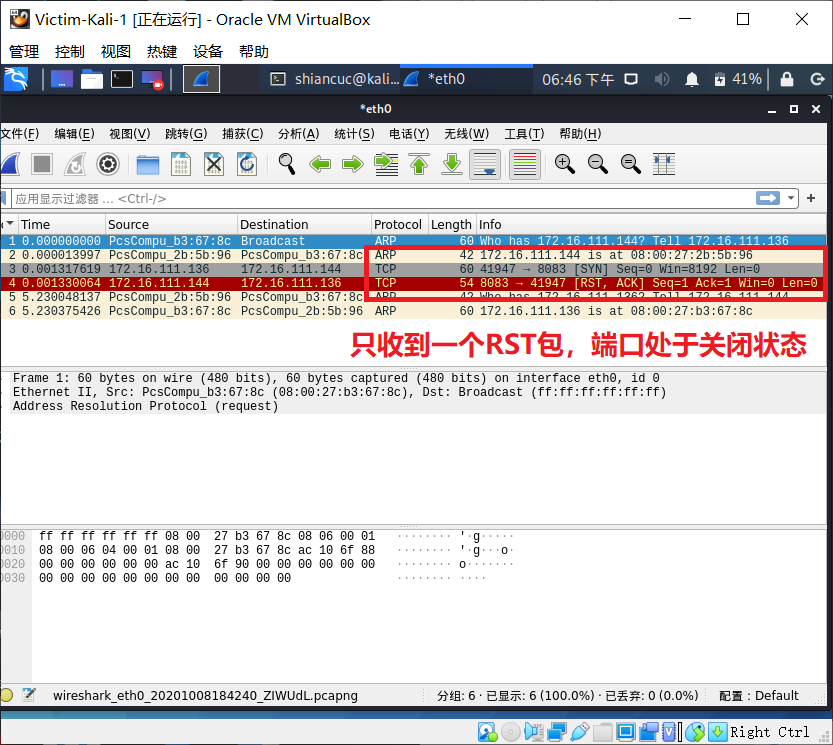
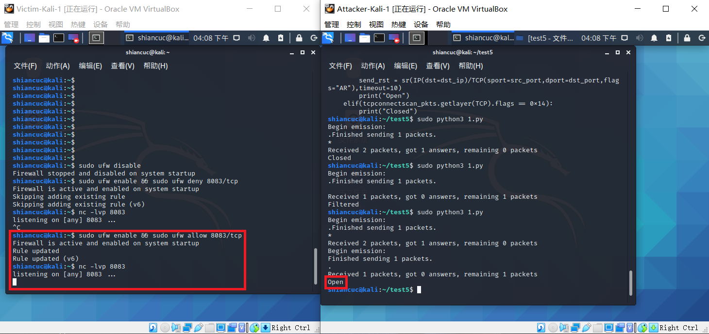

# 基于 Scapy 编写端口扫描器

## 实验目的

- 掌握网络扫描之端口状态探测的基本原理

## 实验环境

- python + scapy
- nmap
- 网络拓扑
    

## 实验准备

### 端口状态的模拟

在```Victim-Kali```中安装```ufw```，用于控制端口打开、关闭以及过滤：```sudo apt install ufw```

- 关闭状态：```sudo ufw disable```
    - 对应端口没有开启监听, 防火墙没有开启
- 过滤状态：```sudo ufw enable && ufw deny portno/tcp(udp)```
    - 对应端口开启监听, 防火墙禁止对应端口访问
- 开启状态：```sudo ufw enable && ufw allow portno/tcp(udp)```
    - 对应端口开启监听: ```http```基于```TCP```, 开启```8083```端口监听可以使用```python3 -m http.server 8083```；```DNS```服务基于```UDP```,在```53```端口提供服务, 开启```53```端口监听可以使用```service dnsmasq start```
    - 防火墙开启对应端口访问

本实验以端口```8083/tcp```和```53/udp```为实验端口

### scapy编程基本使用

```
    pkt=IP()/ICMP()//构造包
    pkt.show()//显示包
    ls()//查看包
    lsc()//列举scapy内置函数
    sr()//包含发送和接受包（网络层)
    srp()//在第二层发送和接受包（数据链路层构造）
    srp1()//只接受1个包
    pkt=IP(dst='172.16.111.141')//目的地址指定
    send(pkt)//只发送数据包
    exit //退出编程模式回到命令行
    ret[ICMP].type //访问数据包
    ret[IP]//访问数据包
    pkt=Ethernet/IP/ICMP//构造更下层的包
    ret [Ether].fields//查看目的地址/源地址/包类型
    pkt=Ether(src='',dst='')//可以构造局域网中的数据包
    help(src) help(IP)//查看官方帮助信息
    q //退出帮助信息
    pkts=sniff(iface='eth0',count=100)//进行抓包，指定100个数据包
    pkts.nsummary()//查看数据包
    pkts[99][IP]//查了第99个包的数据
    pkts[99][Padding]//查看padding信息
    pkts[99][TCP].flag//查看标志位
    pkts=rcap('')//查看抓的包的结果
    help(wrpcap)//保存抓包结果
```

## 实验要求

- [x] 完成以下扫描技术的编程实现
- [x] TCP connect scan / TCP stealth scan
- [x] TCP Xmas scan / TCP fin scan / TCP null scan
- [x] UDP scan
- [x] 上述每种扫描技术的实现测试均需要测试端口状态为：`开放`、`关闭` 和 `过滤` 状态时的程序执行结果
- [x] 提供每一次扫描测试的抓包结果并分析与课本中的扫描方法原理是否相符？如果不同，试分析原因；
  - 基本相符，但是在使用编程扫描的时候比课本中实现的更详细，例如` UDP`扫描中,我们可以看到课本中提供的只是在收到UDP包的情况下可以确认端口为开放状态下，编程实现的过程中还可以通过IP包中是否包含UDP包进行判断端口是否为开放状态。
- [x] 在实验报告中详细说明实验网络环境拓扑、被测试 IP 的端口状态是如何模拟的
- [x] （可选）复刻 `nmap` 的上述扫描技术实现的命令行参数开关（每种扫描测试一种状态，且后面专门用nmap进行了扫描实验）

## 实验过程

### TCP connect scan

```python
#! /usr/bin/python

from scapy.all import *

dst_ip = "172.16.111.144"
src_port = RandShort()
dst_port=8083

tcpconnectscan_pkts = sr1(IP(dst=dst_ip)/TCP(sport=src_port,dport=dst_port,flags="S"),timeout=10)
#if(str(type(tcpconnectscan_pkts))=="<type 'NoneType'>"):
if tcpconnectscan_pkts is None:
	print("Filtered")
elif(tcpconnectscan_pkts.haslayer(TCP)):
	if(tcpconnectscan_pkts.getlayer(TCP).flags == 0x12):
		#send_rst = sr(IP(dst=dst_ip)/TCP(sport=src_port,dport=dst_port,flags="AR"),timeout=10)
		print("Open")
	elif (tcpconnectscan_pkts.getlayer(TCP).flags == 0x14):
		print("Closed")
```

- Closed
    

    

- Filtered
    
    

- Open
    
    

### TCP stealth scan

```python
#! /usr/bin/python

import logging
logging.getLogger("scapy.runtime").setLevel(logging.ERROR)

from scapy.all import *

dst_ip = "172.16.111.144"
src_port = RandShort()
dst_port = 8083

tcpstealthscan_pkts = sr1(
    IP(dst=dst_ip)/TCP(sport=src_port, dport=dst_port, flags="S"), timeout=10)
if tcpstealthscan_pkts is None:
    print("Filtered")
elif(tcpstealthscan_pkts.haslayer(TCP)):
    if(tcpstealthscan_pkts.getlayer(TCP).flags == 0x12):
        send_rst = sr(IP(dst=dst_ip)/TCP(sport=src_port,dport=dst_port, flags="R"), timeout=10)
        print("Open")
    elif (tcpstealthscan_pkts.getlayer(TCP).flags == 0x14):
        print("Closed")
elif(tcpstealthscan_pkts.haslayer(ICMP)):
    if(int(tcpstealthscan_pkts.getlayer(ICMP).type) == 3 and int(tcpstealthscan_pkts.getlayer(ICMP).code) in [1, 2, 3, 9, 10, 13]):
        print("Filtered")
```

- Closed
    
    

- Filtered
    
    

- Open
    
    

### TCP Xmas scan

```python
#! /usr/bin/python

import logging
logging.getLogger("scapy.runtime").setLevel(logging.ERROR)

from scapy.all import *

dst_ip = "172.16.111.144"
src_port = RandShort()
dst_port = 8083

tcpxmasscan_pkts = sr1(
    IP(dst=dst_ip)/TCP(dport=dst_port, flags="FPU"), timeout=10)
if tcpxmasscan_pkts is None:
    print("Open|Filtered")
elif(tcpxmasscan_pkts.haslayer(TCP)):
    if(tcpxmasscan_pkts.getlayer(TCP).flags == 0x14):
        print("Closed")
elif(tcpxmasscan_pkts.haslayer(ICMP)):
    if(int(tcpxmasscan_pkts.getlayer(ICMP).type) == 3 and int(tcpxmasscan_pkts.getlayer(ICMP).code) in [1, 2, 3, 9, 10, 13]):
        print("Filtered")
```

- Closed
    
    

- Filtered
    
    

- Open
    
    

### TCP fin scan

```python
#! /usr/bin/python

import logging
logging.getLogger("scapy.runtime").setLevel(logging.ERROR)

from scapy.all import *

dst_ip = "172.16.111.144"
src_port = RandShort()
dst_port = 8083

tcpfinscan_pkts = sr1(
    IP(dst=dst_ip)/TCP(dport=dst_port, flags="F"), timeout=10)
if tcpfinscan_pkts is None:
    print("Open|Filtered")
elif(tcpfinscan_pkts.haslayer(TCP)):
    if(tcpfinscan_pkts.getlayer(TCP).flags == 0x14):
        print("Closed")
elif(tcpfinscan_pkts.haslayer(ICMP)):
    if(int(tcpfinscan_pkts.getlayer(ICMP).type) == 3 and int(tcpfinscan_pkts.getlayer(ICMP).code) in [1, 2, 3, 9, 10, 13]):
        print("Filtered")
```

- Closed
    
    

- Filtered
    
    

- Open
    
    

### TCP null scan

```python
#! /usr/bin/python

import logging
logging.getLogger("scapy.runtime").setLevel(logging.ERROR)

from scapy.all import *

dst_ip = "172.16.111.144"
src_port = RandShort()
dst_port = 8083

tcpnullscan_pkts = sr1(
    IP(dst=dst_ip)/TCP(dport=dst_port, flags=""), timeout=10)
if tcpnullscan_pkts is None:
    print("Open|Filtered")
elif(tcpnullscan_pkts.haslayer(TCP)):
    if(tcpnullscan_pkts.getlayer(TCP).flags == 0x14):
        print("Closed")
elif(tcpnullscan_pkts.haslayer(ICMP)):
    if(int(tcpnullscan_pkts.getlayer(ICMP).type) == 3 and int(tcpnullscan_pkts.getlayer(ICMP).code) in [1, 2, 3, 9, 10, 13]):
        print("Filtered")
```

- Closed
    
    

- Filtered
    
    

- Open
    
    

### UDP scan

```python
#! /usr/bin/python

import logging
logging.getLogger("scapy.runtime").setLevel(logging.ERROR)

from scapy.all import *

dst_ip = "172.16.111.144"
src_port = RandShort()
dst_port = 53
dst_timeout = 10

def udp_scan(dst_ip,dst_port,dst_timeout):
    udp_scan_resp = sr1(IP(dst=dst_ip)/UDP(dport=dst_port), timeout=dst_timeout)
    if(udp_scan_resp is None):
        print("Open|Filtered")
    elif(udp_scan_resp.haslayer(UDP)):
        print("Open")
    elif(udp_scan_resp.haslayer(ICMP)):
        if(int(udp_scan_resp.getlayer(ICMP).type) == 3 and int(udp_scan_resp.getlayer(ICMP).code) == 3):
            print("Closed")
        elif(int(udp_scan_resp.getlayer(ICMP).type) == 3 and int(udp_scan_resp.getlayer(ICMP).code) in [1, 2, 9, 10, 13]):
            print("Filtered")
        elif(udp_scan_resp.haslayer(IP) and udp_scan_resp.getlayer(IP).proto == IP_PROTOS.udp)
            print("Open")

udp_scan(dst_ip,dst_port,dst_timeout)
```

- Closed
    
    

- Filtered
    
    

- Open
    
    
    

### 使用```nmap```进行扫描

#### ```TCP connect scan```
- ```sudo nmap -sT 172.16.111.144 -p 8083```
- Closed
    

- Filtered
    

- Open
    

#### ```TCP stealth scan```
- ```sudo nmap -sS 172.16.111.144 -p 8083```
- Closed
    

- Filtered
    

- Open
    

#### ```TCP Xmas scan```
- ```sudo nmap -sX 172.16.111.144 -p 8083```
- Closed
    

- Filtered
    

- Open
    

#### ```TCP FIN scan```
- ```sudo nmap -sF 172.16.111.144 -p 8083```
- Closed
    

- Filtered
    

- Open
    

#### ```TCP NULL scan```
- ```sudo nmap -sN 172.16.111.144 -p 8083```
- Closed
    

- Filtered
    

- Open
    

#### ```UDP scan```
- ```sudo nmap -sU 172.16.111.144 -p 53```
- Closed
    

- Filtered
    

- Open
    

## 问题

- ```ufw allow 8083/tcp```无法使端口处于开启状态
    - 原因：没有```TCP```服务开启，端口无法监听。```ufw```只能控制端口是否可达，不能决定端口的开启和关闭。

    


## 参考资料

- [基于 Scapy 编写端口扫描器](https://c4pr1c3.github.io/cuc-ns/chap0x05/exp.html)

- [2019-NS-Public-chencwx/ns_chapter5/网络扫描实验报告.md](https://github.com/CUCCS/2019-NS-Public-chencwx/blob/ns_chap0x05/ns_chapter5/%E7%BD%91%E7%BB%9C%E6%89%AB%E6%8F%8F%E5%AE%9E%E9%AA%8C%E6%8A%A5%E5%91%8A.md)

- [2019-NS-Public-hejueyun/chap0x05/README.md](https://github.com/CUCCS/2019-NS-Public-hejueyun/blob/chap0x05/chap0x05/README.md)

- [Kali防火墙ufw安装与命令](https://blog.csdn.net/SIMBA1949/article/details/104979444)

- [scapy的基本用法](https://www.cnblogs.com/vocus/p/12783679.html)
