# 防火墙配置与使用

## 实验环境准备

- 虚拟机使用 NAT + Internal / Host-only 方式联网，安装 proftpd / Apache2
- 使用 stand alone 模式启动 proftpd
- 配置 proftpd 支持匿名访问

## 实验拓扑图

- 网关和victim默认可以互相访问

    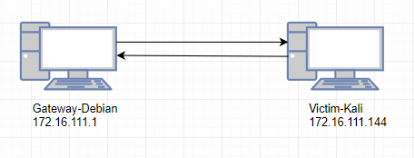

## 实验过程

### iptables配置实例

- 基本使用

    ```bash
    # （1）传输层防护实例

    # 禁止其它机器通过ssh连接自己

    iptables -t filter -A INPUT -p tcp --dport 22 -j DROP

    # 查看主机防火墙规则

    iptables -t filter -L

    # 防止各种端口扫描

    # 以下规则设定，假设 FORWARD 链默认规则为 DROP 
    # 限制 SYN 请求的频率为：每秒 1 个
    # tcp-flags 的第一个参数 ALL 表示检查 TCP 的所有状态标志位
    # ALL 等价于 SYN,ACK,FIN,RST,URG,PSH （顺序无关，这是一个集合匹配）
    # tcp-flags 的第二个参数 SYN 表示仅匹配设置了 SYN 标志位的报文
    # 其中参数--limit 1/s 表示每秒一次; 1/m 则为每分钟一次
    iptables -A FORWARD -p tcp --tcp-flags ALL SYN -m limit --limit 1/s -j ACCEPT

    # 禁止 XMAS 扫描
    iptables -A INPUT -p tcp --tcp-flags ALL FIN,PSH,URG -j DROP

    # 记录 XMAS 扫描到系统日志
    iptables -A INPUT -p tcp --tcp-flags ALL FIN,PSH,URG -m limit --limit 3/m --limit-burst 5 -j LOG --log-prefix "XMAS scan "

    # 限制 ping 20 秒内不得超过 6 次
    iptables -A INPUT -p icmp --icmp-type echo-request -m recent --name ICMP_check --rcheck --seconds 20 --hitcount 6 -j DROP
    iptables -A INPUT -p icmp --icmp-type echo-request -m recent --set --name ICMP_check
    # 以下是示例测试结果
    #PING 192.168.56.104 (192.168.56.104) 56(84) bytes of data.
    #64 bytes from 192.168.56.104: icmp_seq=1 ttl=64 time=0.237 ms
    #64 bytes from 192.168.56.104: icmp_seq=2 ttl=64 time=0.426 ms
    #64 bytes from 192.168.56.104: icmp_seq=3 ttl=64 time=0.557 ms
    #64 bytes from 192.168.56.104: icmp_seq=4 ttl=64 time=0.416 ms
    #64 bytes from 192.168.56.104: icmp_seq=5 ttl=64 time=0.478 ms
    #64 bytes from 192.168.56.104: icmp_seq=6 ttl=64 time=0.371 ms
    #64 bytes from 192.168.56.104: icmp_seq=21 ttl=64 time=0.380 ms
    #64 bytes from 192.168.56.104: icmp_seq=22 ttl=64 time=0.553 ms
    #64 bytes from 192.168.56.104: icmp_seq=23 ttl=64 time=0.424 ms
    #64 bytes from 192.168.56.104: icmp_seq=24 ttl=64 time=0.377 ms
    #64 bytes from 192.168.56.104: icmp_seq=25 ttl=64 time=0.334 ms
    #64 bytes from 192.168.56.104: icmp_seq=26 ttl=64 time=0.370 ms
    #64 bytes from 192.168.56.104: icmp_seq=41 ttl=64 time=0.397 ms

    # 禁止自己主机使用FTP协议下载（即封闭TCP协议的21端口）

    iptables -I OUTPUT -p tcp --dprot 21 -j DROP

    # 禁用主机的DNS端口(DNS为UDP协议，使用53端口)

    iptables -I OUTPUT -p udp --dport 53 -j DROP

    # （2）网络层防护实例

    # 防止ping洪水攻击。例如，限制ping的并发数，每秒一次。
    # 在 FORWARD 链上设置规则说明 iptables 所在主机是一个网关，可以限制内网主机去扫外网其他主机
    # 如果在 INPUT 链上设置规则，则说明 iptables 保护的是主机自己
    # FORWARD 上设置的这种限速措施可以理解为是从攻击源头进行治理，预防从自己管的这个片区出去的犯罪行为
    iptables -A FORWARD -p icmp --icmp-type echo-request -m limit --limit 1/s -j ACCEPT

    # 限制一个ip访问自己主机。例如，以下这条命令限制了ip地址为192.168.1.102主机对自己的访问。

    iptables -A INPUT -s 192.168.1.102 -j DROP

    # （3）数据链路层防护实例

    # 阻断来自某个mac地址的数据包

    iptables -A INPUT -m mac --mac-source 00:1e:ec:f0:ae:77 -j DROP

    # 上面的命令阻断了mac地址为00:1e:ec:f0:ae:77 对本机的连接。

    # 查看本机iptables表
    iptables -L -n
    iptables -L -n -t nat
    ```

- 禁止指定 IP 访问

    ```bash
    #!/bin/bash

    # iptables script generated 2011-10-13
    # http://www.mista.nu/iptables

    IPT="/sbin/iptables"

    # Flush old rules, old custom tables
    $IPT --flush
    $IPT --delete-chain

    # Set default policies for all three default chains
    $IPT -P INPUT DROP
    $IPT -P FORWARD DROP
    $IPT -P OUTPUT ACCEPT

    # Enable free use of loopback interfaces
    $IPT -A INPUT -i lo -j ACCEPT
    $IPT -A OUTPUT -o lo -j ACCEPT

    # All TCP sessions should begin with SYN
    $IPT -A INPUT -p tcp ! --syn -m state --state NEW -s 0.0.0.0/0 -j DROP

    # Accept inbound TCP packets
    $IPT -A INPUT -m state --state ESTABLISHED,RELATED -j ACCEPT

    # Block a specific IP address
    $IPT -A INPUT -p IP -s 192.168.56.1 -j DROP
    ```

- 禁止 TCP / UDP 指定端口访问

    ```bash
    #!/bin/bash

    # iptables script generated 2011-10-13
    # http://www.mista.nu/iptables

    IPT="/sbin/iptables"

    # Flush old rules, old custom tables
    $IPT --flush
    $IPT --delete-chain

    # Set default policies for all three default chains
    $IPT -P INPUT DROP
    $IPT -P FORWARD DROP
    $IPT -P OUTPUT ACCEPT

    # Enable free use of loopback interfaces
    $IPT -A INPUT -i lo -j ACCEPT
    $IPT -A OUTPUT -o lo -j ACCEPT

    # All TCP sessions should begin with SYN
    $IPT -A INPUT -p tcp ! --syn -m state --state NEW -s 0.0.0.0/0 -j DROP

    # Accept inbound TCP packets
    $IPT -A INPUT -m state --state ESTABLISHED,RELATED -j ACCEPT

    $IPT -A INPUT -p tcp --dport 22 -m state --state NEW -s 0.0.0.0/0 -j DROP

    # 通过在源和目的主机(防火墙所在主机)上抓包，对比DROP和REJECT指令在防火墙响应行为上的差异
    #$IPT -A INPUT -p tcp --dport 22 -m state --state NEW -s 0.0.0.0/0 -j REJECT
    ```

- 禁止 ICMP ping

    ```bash
    #!/bin/bash

    # iptables script generated 2011-10-13
    # http://www.mista.nu/iptables

    IPT="/sbin/iptables"

    # Flush old rules, old custom tables
    $IPT --flush
    $IPT --delete-chain

    # Set default policies for all three default chains
    $IPT -P INPUT DROP
    $IPT -P FORWARD DROP
    $IPT -P OUTPUT ACCEPT

    # Enable free use of loopback interfaces
    $IPT -A INPUT -i lo -j ACCEPT
    $IPT -A OUTPUT -o lo -j ACCEPT

    # All TCP sessions should begin with SYN
    $IPT -A INPUT -p tcp ! --syn -m state --state NEW -s 0.0.0.0/0 -j DROP

    # Accept inbound TCP packets
    $IPT -A INPUT -m state --state ESTABLISHED,RELATED -j ACCEPT

    # DROP inbound ICMP messages
    $IPT -A INPUT -p ICMP --icmp-type 8 -s 0.0.0.0/0 -j DROP
    ```

- 在victim访问外网之前使用`iptables -L -n -t filter -v`查看chain的状态，发现包的数量都为0

    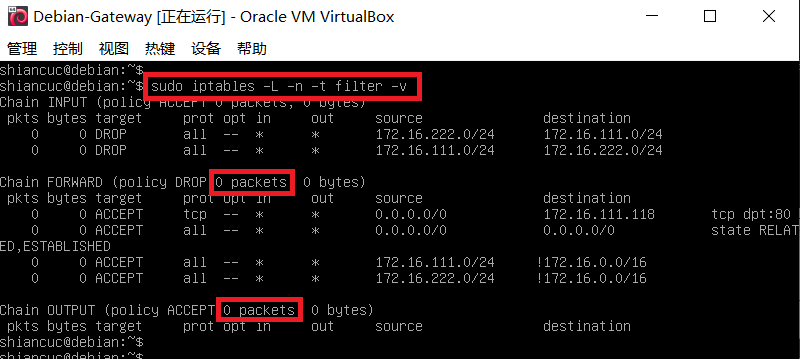

- victim执行`ping -c 2 sec.cuc.edu.cn`，发现gateway中多了两个包

    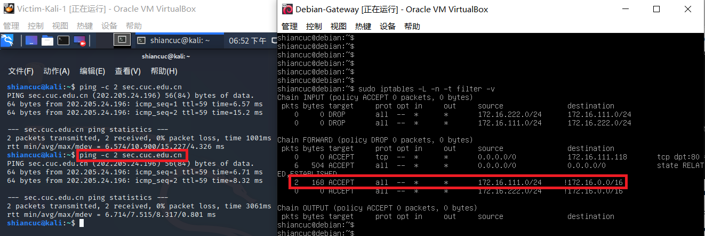

- 说明了流量经过了网关

- iptables规则编辑

    ```bash
    # 导出当前防火墙规则到文件
    iptables-save > iptables.rules

    # 备份当前规则文件
    cp iptables.rules iptables.rules.bak

    # 用文本编辑器编辑上一步备份出来的当前 iptables 规则文件的副本 iptables.rules

    # 应用编辑后的防火墙规则
    # -c  指定在还原 iptables 时候，重置当前的数据包计数器和字节计数器的值为零
    iptables-restore < iptables.rules

    # 随时可以使用之前备份的 iptables.rules.bak 来重置回最近一次没问题的规则
    ```

- 根据上述指令查看到了默认的iptables规则

    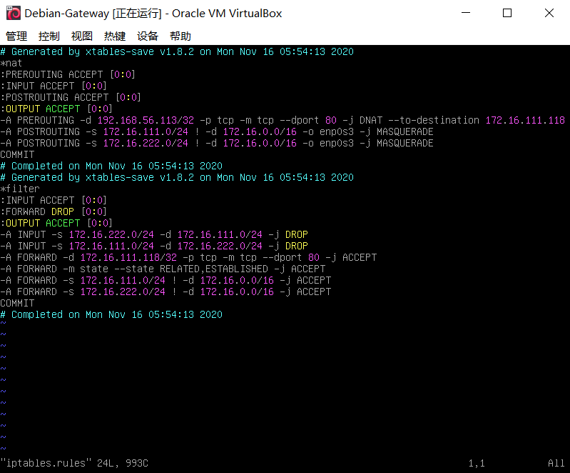

***
### 网络层

- 使用以下代码，禁止icmp执行`ping`，并保存

    ```bash
    $IPT -A INPUT -p ICMP --icmp-type 8 -s 0.0.0.0/0 -j DROP
    ```

    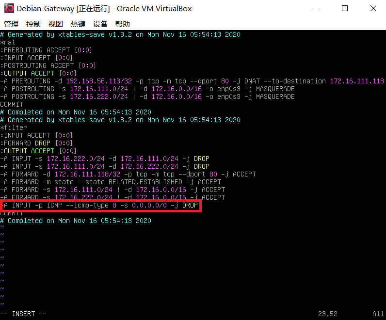

    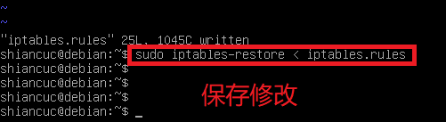

- 此时victim机ping不通网关但是能ping通外网，说明设置确实生效了，因为forward我们并未设置，只设置了input链的drop,所以能正常访问

    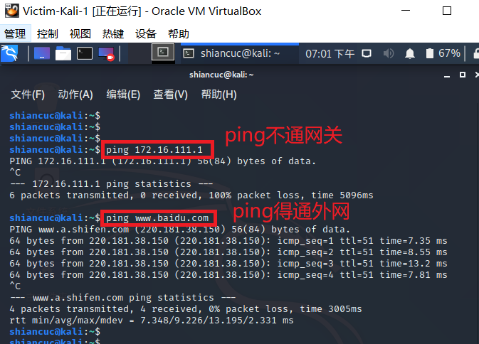

- 使用以下代码对指定ip的ip包drop

    ```bash
    $IPT -A INPUT -p IP -s 192.168.56.1 -j DROP
    ```

    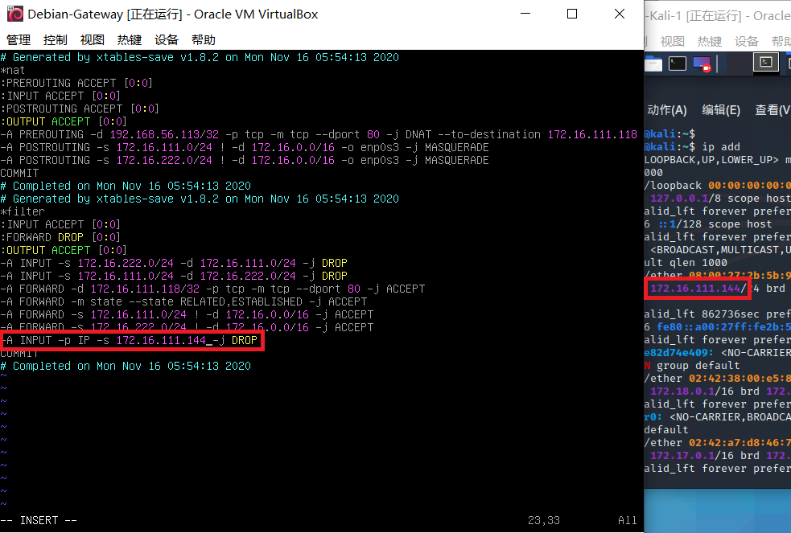

- 此时victim确实ping不通网关了

    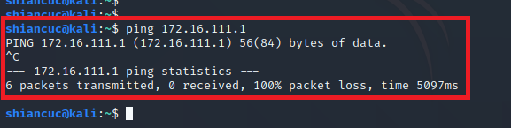

- 查看iptables状态，发现确实被drop了

    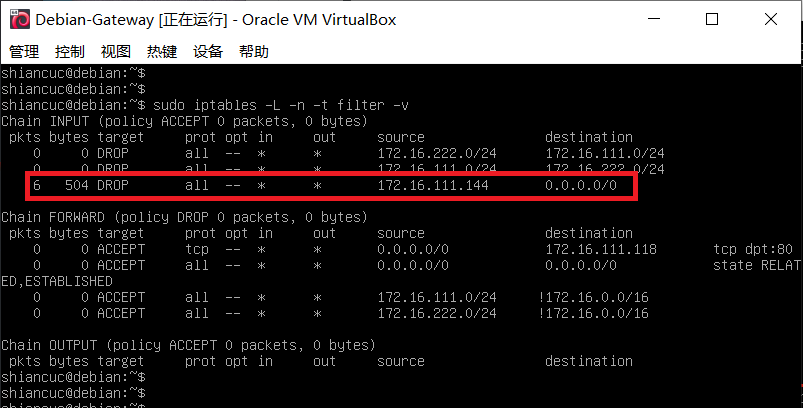

***
### 传输层

- 设置防火墙规则以禁止其它机器通过ssh连接自己

    ```bash
    # （1）传输层防护实例
    iptables -t filter -A INPUT -p tcp --dport 22 -j DROP
    ```

    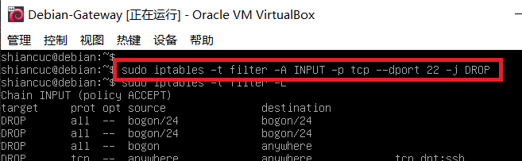

- 在设置之前发现ssh能远程登录

    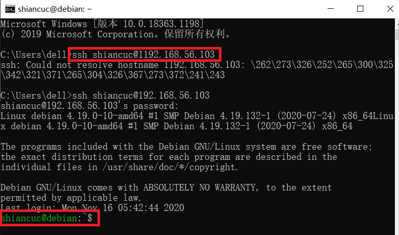

- 设置规则后发现远程登录不成功，说明过滤规则确实发生了作用

    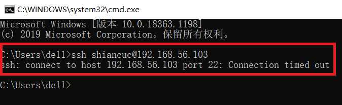

- 为了进一步证明上述规则，我们把刚刚那条规则删去以后，发现又可以进行ssh远程登录了

    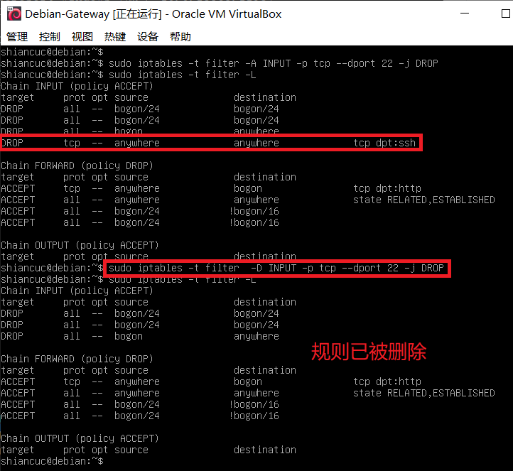

    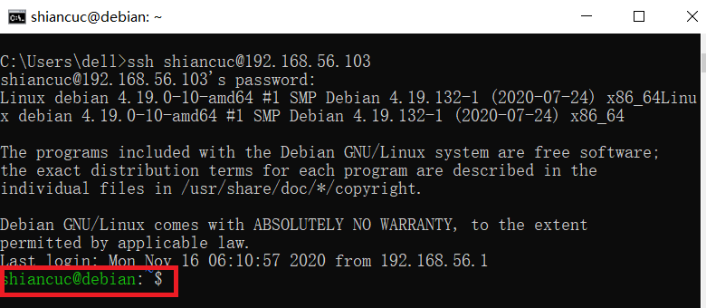

***
### 数据链路层

- 阻断来自某个mac地址的数据包

    ```bash
    iptables -A INPUT -m mac --mac-source 08:00:27:f3:96:90 -j DROP

    # 上面的命令阻断了mac地址为08:00:27:f3:96:90(victim) 对本机的连接。
    ```

    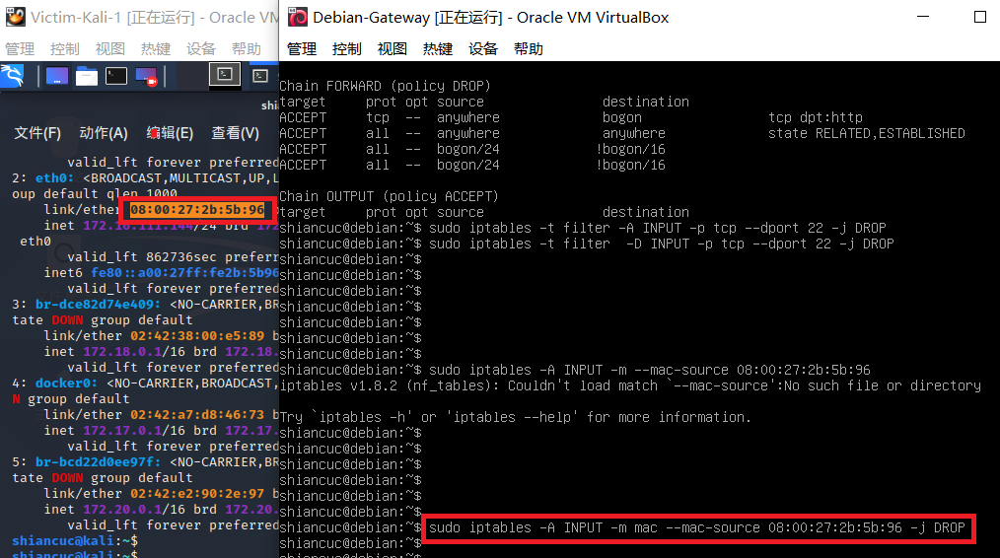

- 此时victim不能访问网关，但是不影响其访问别的外网

    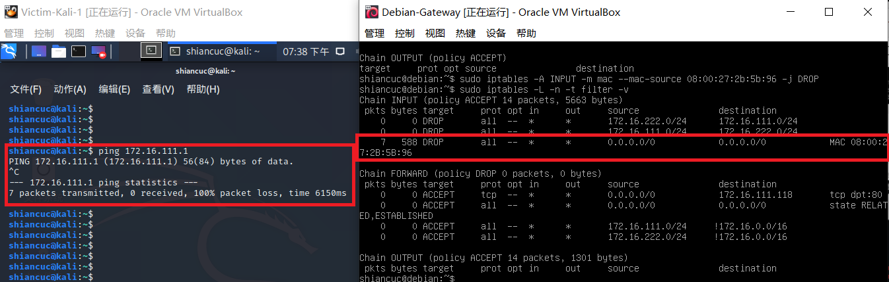

***
### 应用层

- 匹配应用层指定字符串

- 输入以下string限制规则

    ```bash
    $IPT -A INPUT -p tcp -m string --algo bm --string 'Apache' -j REJECT --reject-with tcp-reset
    ```

- 在未添加过滤规则时，victim可以直接通过apache访问网关

    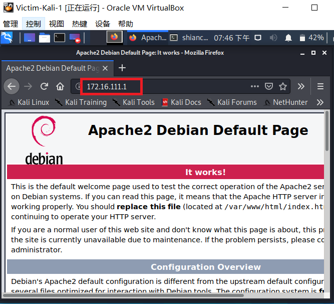

- 对debian网关添加过滤规则，但是发现仍然可以访问，原因是我们设置的过滤规则是INPUT栈，但是apache界面是由server提供出去的

    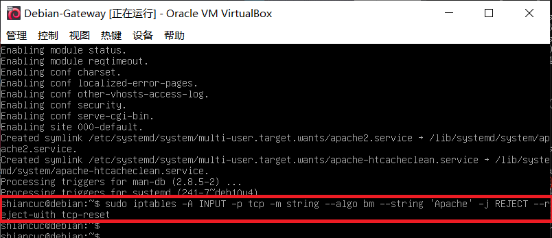

- 在请求参数中添加一些string请求，添加了`error`，则这个参数肯定要经过INPUT链，则实验预计会成功

    ```bash
    iptables -A INPUT -p tcp -m string --algo bm --string 'error' -j REJECT --reject-with tcp-reset
    ```

    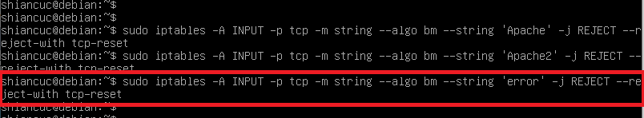

- 我们查看当前iptables的规则，可以看到过滤条件

    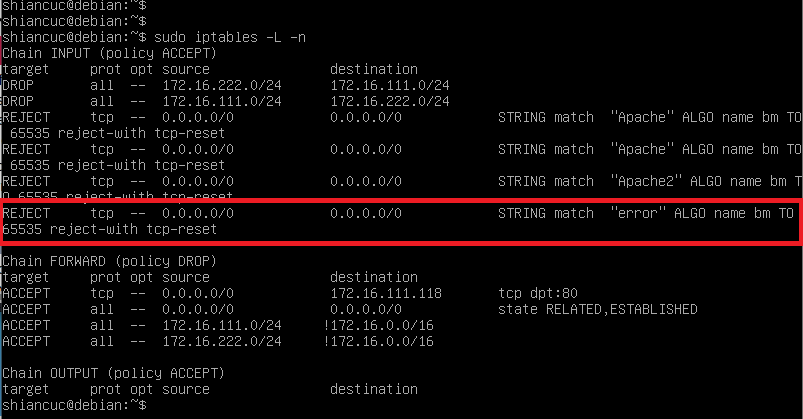

- 接下来再对网关进行访问，预计达到效果应为返回的apache界面，发现结果也却为该界面，其实这在某种程度上实现了ip欺骗

    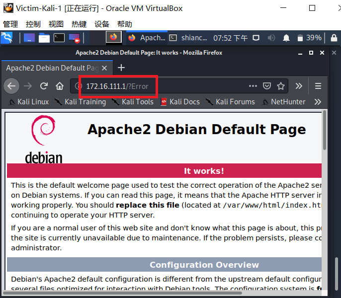

***
### 课外补充实验

- 实验要求

  局域网拓扑如下：

  ```
  +----------------------+          +-------------------------+       +----------------------+     
  |     host-1           |          |   host-2                |       |     host-3           |  
  |     172.16.18.11     |          |   eth0:0 172.16.18.1    |       |     172.16.18.12     |  
  |                      |          |   eth0: 192.168.1.123   |       |                      |  
  +-------------+--------+          +----------+--------------+       +-------------+--------+  
                |                              |                                    |
                |                              |                                    |
       +--------+------------------------------+--+                                 |
       |                交换机                    |---------------------------------+
       +-----------------+------------------------+
                         |
                         |
                   +-----+-----------+
                   |   eth0          |   `
                   |   192.168.1.1   |
                +--+-----------------+---------+
                |                              |
                |        host-gw / dns-svr     |
                |                              |
                +------------------+----------++
                                   |  eth1    |
                                   +----------+
  ```

  上图的补充文字说明如下：

  - host-gw 指的是该局域网的网关，已经配置为 NAT 方式，局域网内的主机 host-2 可以正常无障碍访问互联网；
  - dns-svr 指的是该局域网中的 DNS 解析服务器，可以正常提供域名解析服务；
  - 交换机没有设置 VLAN，所有端口正常工作；
  - host-2上配置了 iptables规则；
  - host-1上配置了默认网关指向 IP 地址：172.16.18.1，域名解析服务器配置为 IP：192.168.1.1
  - host-3上配置了默认网关指向 IP 地址：172.16.18.1，域名解析服务器配置为 IP：192.168.1.1

<br>

- **实验内容**

    - 解释host-2 上的 iptables 配置脚本

        ```bash
        #!/bin/bash

        IPT="/sbin/iptables"

        $IPT --flush
        # 清空所有链中所有规则
        $IPT --delete-chain
        # 删除所有空链

        $IPT -P INPUT DROP
        # INPUT链默认DROP规则，即默认丢包
        $IPT -P FORWARD DROP
        # FORWARD规则DROP规则，即默认丢包
        $IPT -P OUTPUT ACCEPT
        # OUTPUT链默认ACCEPT规则，即默认输出

        $IPT -N forward_demo
        # 新建forward_demo链
        $IPT -N icmp_demo
        # 新建icmp_demo链

        $IPT -A INPUT -i lo -j ACCEPT
        # 允许回环网卡数据输入
        $IPT -A OUTPUT -o lo -j ACCEPT
        # 允许回环网卡数据输出

        $IPT -A INPUT -p tcp ! --syn -m state --state NEW -s 0.0.0.0/0 -j DROP
        # 丢弃所有不包含SYN的、建立TCP请求的包
        $IPT -A INPUT -m state --state ESTABLISHED,RELATED -j ACCEPT
        # 接收所有入站TCP数据包
        $IPT -A INPUT -p icmp -j icmp_demo
        # 对ICMP包接收，跳转到icmp_demo链上规则处理

        $IPT -A icmp_demo -p icmp -i eth0 -j ACCEPT
        # 接收eth0进入的icmp包
        $IPT -A icmp_demo -j RETURN
        # 从子链（当前icmp_demo链）返回父链（调用链），即丢包

        $IPT -A FORWARD -j forward_demo
        # forward_demo处理路由转发

        $IPT -A forward_demo -j LOG --log-prefix FORWARD_DEMO
        # 把forward_demo链的日志记录到命名前缀为FORWARD_DEMO的日志
        $IPT -A forward_demo -p tcp --dport 80 -m string --algo bm --string 'baidu' -j DROP
        # 禁止转发URL里有‘baidu’的tcp包
        $IPT -A forward_demo -p tcp -s 172.16.18.11 -j ACCEPT
        # 转发来自host-1的tcp包
        $IPT -A forward_demo -p tcp -d 172.16.18.11 -j ACCEPT
        # 转发前往host-1的tcp包
        $IPT -A forward_demo -p udp -s 172.16.18.11 --dport 53 -j ACCEPT
        # 转发来自host-1的udp包
        $IPT -A forward_demo -p udp -s 172.16.18.1  --dport 53 -j ACCEPT
        #  转发来自host-2的udp包
        $IPT -A forward_demo -p udp -s 192.168.1.1  --sport 53 -j ACCEPT
        #  转发来自host-gw的udp包
        $IPT -A forward_demo -p tcp -s 192.168.1.1 -j ACCEPT
        # 转发自host-gw的的tcp包 
        $IPT -A forward_demo -s 172.16.18.1 -j RETURN
        # 对来自host-2的数据包，转父链处理，即丢包
        $IPT -t nat -A POSTROUTING -s 172.16.18.1/24 -o eth0 -j MASQUERADE
        # 对172.16.18.1/24网段的数据包，动态读取eth0的ip做SNAT然后输出
        ```

    - 思考

        **1. host-1可以ping通ip: 172.16.18.1吗？**

        - 可以

        > 根据`$IPT -A icmp_demo -p icmp -i eth0 -j ACCEPT`，接收eth0进入的icmp包；同时注意到hsot-2配置了虚拟网卡eth0:0，故host-2接收来自host-1的`echo requset`；而根据`$IPT -P OUTPUT ACCEPT`，host-2将返回`echo reply`，故可以ping通

        **2. host-1可以ping通ip: 192.168.1.1吗？**

        - 可以

        > 因为host-2式host-1的默认网关，所以携带icmp的以太网帧会先到达host-2。同1题，host-2接收来自host-1的icmp包，而此时**源地址**需要从172.16.18.x/24路由转到192.168.1.x/24(**SNAT**)，根据`$IPT -t nat -A POSTROUTING -s 172.16.18.1/24 -o eth0 -j MASQUERADE`，做了ip转换后输出，最终到达host-gw.
        >
        > 假设host-gw接收`echo request`，返回`echo reply`，host-2将将目的地址做DNAT（**这不是依赖于iptables的规则，而是依赖于之前内存保存的翻译的映射关系，反过来使用**），并最终送达host-1

        **3. host-1可以ping通域名:www.baidu.com吗？**

        - 不可以

        > `$IPT -A forward_demo -p tcp --dport 80 -m string --algo bm --string 'baidu' -j DROP`，`host-2`禁止转发URL里有‘baidu’的包，而`host-1`的默认网关是`host-2`，需要经由`host-2`转发到`dns-svr`，故无法ping通

        **4. host-1可以访问: http://61.135.169.121 吗？**

        - 可以

        > host-1发送以太网帧到host-2，host-2做动态ip转换再发给host-gw，host-gw做nat发送最终的`http get`
        >
        > host-gw发送`http response`到host-2，host-2做DNAT，返回给host-1

        **5. host-3可以ping通ip: 172.16.18.1 吗？**

        - 可以

        > 原因见1

        **6. host-3可以ping通ip: 192.168.1.1吗？**

        - 可以

        > 原因见2

        **7. host-3可以访问互联网吗？**

        - 基本可以

        > 除了URL带‘baidu’的


## 参考资料

- [第八章实验](https://c4pr1c3.github.io/cuc-ns/chap0x08/exp.html)

- [2019-NS-Public-chencwx/ns_chapter8/防火墙配置与使用.md](https://github.com/CUCCS/2019-NS-Public-chencwx/blob/ns_chap0x08/ns_chapter8/%E9%98%B2%E7%81%AB%E5%A2%99%E9%85%8D%E7%BD%AE%E4%B8%8E%E4%BD%BF%E7%94%A8.md)

- [iptables详细教程：基础、架构、清空规则、追加规则、应用实例 - Lesca 技术宅](http://lesca.me/archives/iptables-tutorial-structures-configuratios-examples.html)

- [2019-NS-Public-hejueyun/chap0x08/README.md](https://github.com/CUCCS/2019-NS-Public-hejueyun/blob/chap0x08/chap0x08/README.md)