# 应用程序安全加固

## 实验目的

- 从web和ssh方面进行应用程序安全加固的体验

## 实验环境

- Kali-Attacker和Victim-Kali两台互相连通的主机

    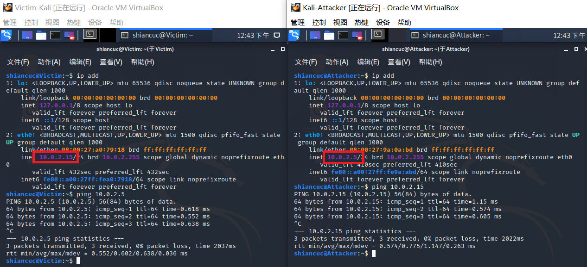


## 实验过程

### Apache内置安全设施

- 查看可用的模块并搜索需要的security模块

    ```bash
    ls -l /etc/apache2/mods-enabled/

    # 搜索security软件包
    apt search apache | grep security
    ```

    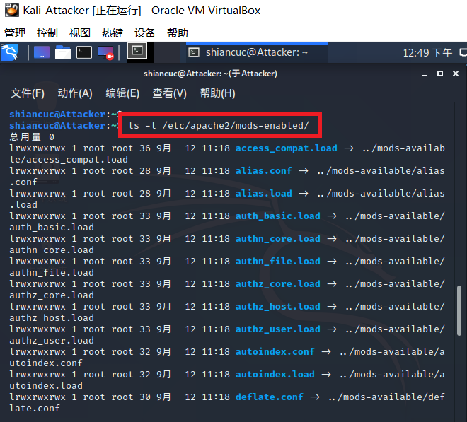

    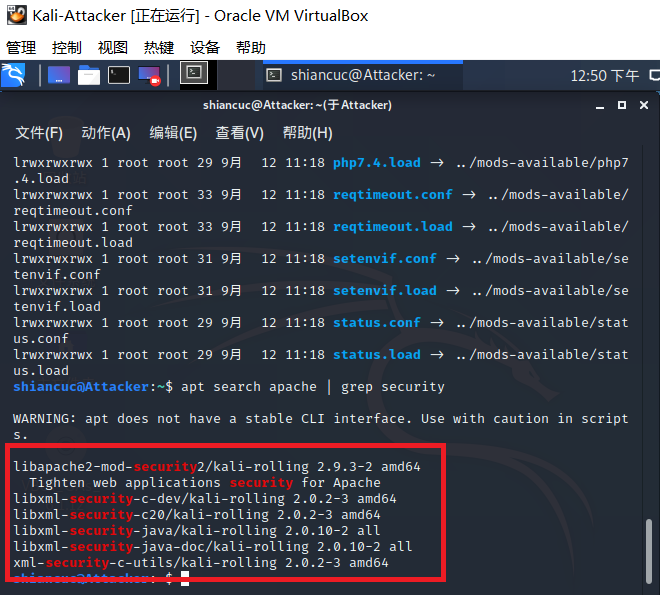

- 安装相关模块

    ```bash
    apt update && apt-get install libapache2-mod-security2
    ```

    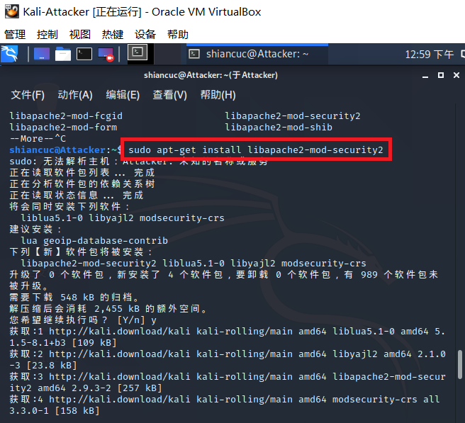

- 查看刚刚下载的与security相关的包

    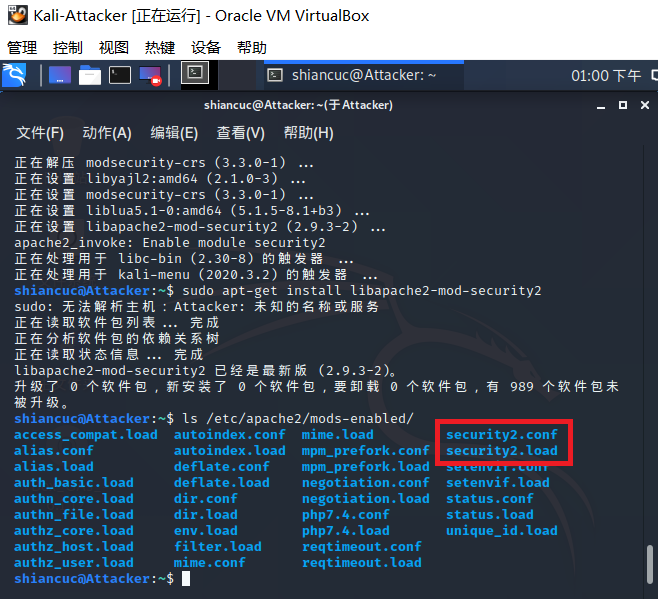

- 配置规则

    ```bash
    # 备份规则
    mv /usr/share/modsecurity-crs /usr/share/modsecurity-crs.bk

    # 下载 OWASP ModSecurity Core Rule Set
    git clone https://github.com/SpiderLabs/owasp-modsecurity-crs.git /usr/share/modsecurity-crs

    # 启用配置文件
    cd owasp-modsecurity-crs
    mv crs-setup.conf.example crs-setup.conf

    # 修改配置
    vim /etc/apache2/mods-enabled/security2.conf

     # 在文件中添加规则路径
    <IfModule security2_module> 
        SecDataDir /var/cache/modsecurity 
        IncludeOptional /etc/modsecurity/*.conf 
        IncludeOptional /usr/share/modsecurity-crs/*.conf 
        IncludeOptional /usr/share/modsecurity-crs/rules/*.conf 
    </IfModule>

    # 启用引擎
    vim /etc/modsecurity/modsecurity.conf

    # 将 DectionOnly 改为 On
    SecRuleEngine On

    # 重启以生效
    systemctl restart apache2
    ```

    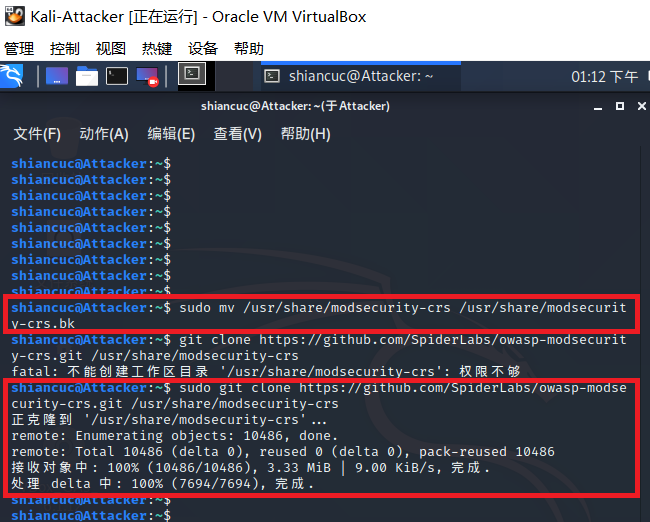

    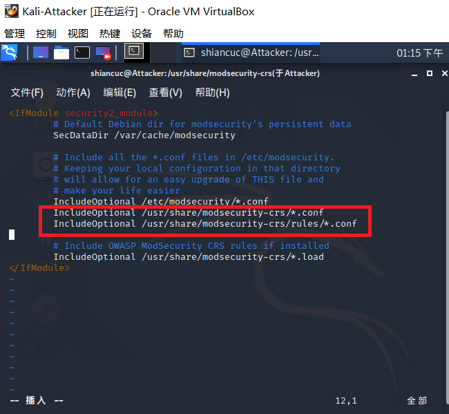

- 将配置生效

    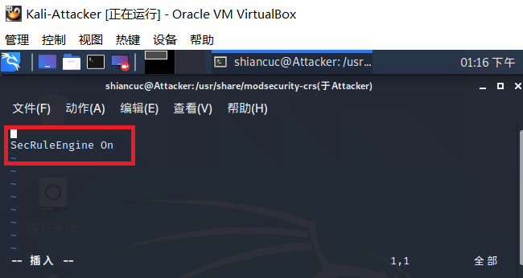

    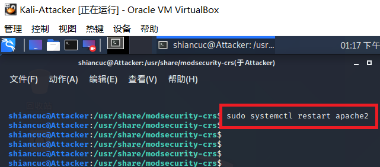

- 让攻击者主机对靶机进行简单的xss攻击（使用curl命令），发现被拒绝

    ```bash
    curl 'http://10.0.2.5/?q="><script>alert(1)</script>'
    ```

    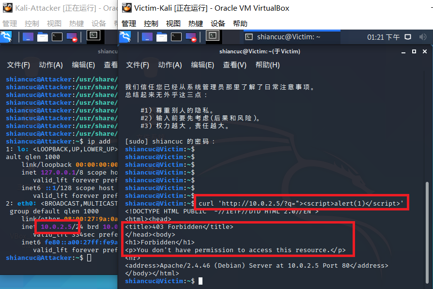

- 查看日志文件，会发现该行为被记录了下来

    ```bash
    tail error.log
    ```

    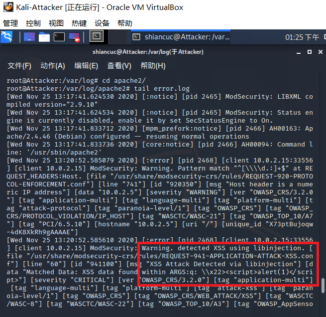

- 至此，说明我们的规则设置生效了，此时的Web应用安全确实加固了，可用预防一些owasp中的一些攻击并且能通过日志记录下来


### fail2ban

**ssh**

- 修改Victim的ssh配置

    ```bash
    # 启动服务
    systemctl start ssh

    # 修改配置文件，允许Root用户使用ssh登录
    vim /etc/ssh/sshd_config
    PermitRootLogin	yes # 在Authentication部分添加

    # 重启ssh服务
    systemctl restart ssh
    ```

    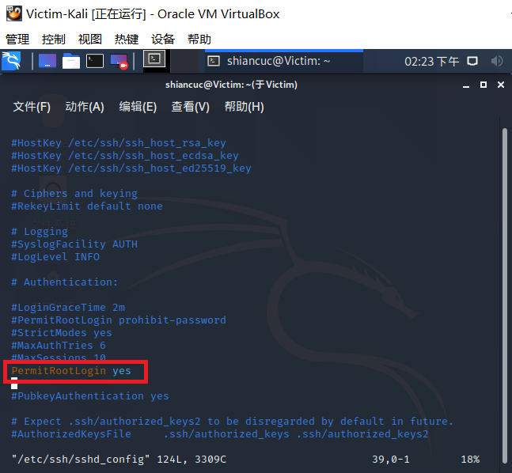

- 攻击者主机在修改配置前不能够进行ssh连接，修改配置后能够正常ssh连接

    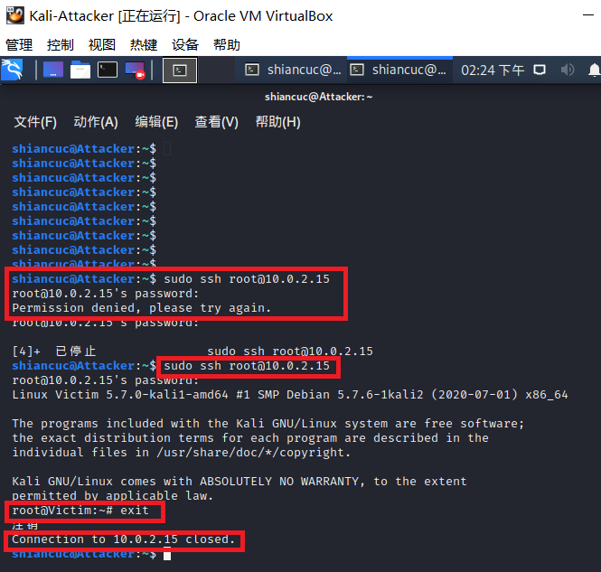

**爆破ssh**

- 解压爆破字典，使用字典进行爆破

    ```bash
    # 解压爆破字典
    gzip -d /usr/share/wordlists/rockyou.txt.gz

    # 类似的爆破工具还有：medusa/ncrack
    hydra -l root -P /usr/share/wordlists/rockyou.txt -v 10.0.2.15 ssh
    ```

    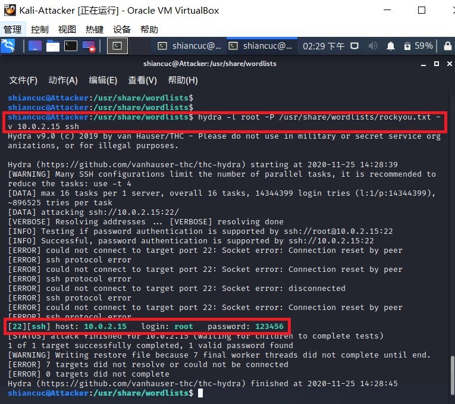

- 弱口令很快就会被爆破出来

**fail2ban**

- 安装并启动后，并没有开启任何一个jail，需要手动设置开启

    ```bash
    # 安装
    git clone https://github.com/fail2ban/fail2ban.git
    cd fail2ban
    sudo python setup.py install

    # 查看是否安装成功
    fail2ban-client -h

    # 启动 fail2ban
    fail2ban-client start

    # 预置的jail
    ls /etc/fail2ban/filter.d/
    ```

    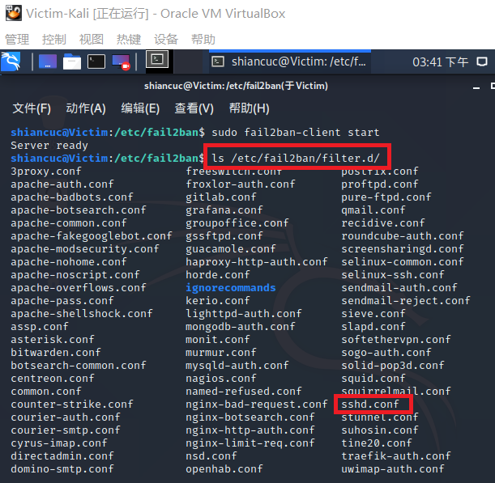

- 可对 jail.conf fail2ban.conf 等配置文件中的配置项进行自定义配置（需要注意格式）

    ```bash
    # 拷贝配置文件并重命名为 `jail.local`
    cp /etc/fail2ban/fail2ban.conf /etc/fail2ban/jail.local
    vim /etc/fail2ban/jail.local

    # 添加以下内容开启sshd jail
    [sshd]
    enabled = true

    # 查看相关的配置信息
    # 默认禁止时间为 10 min ，可在 `jail.local` 文件中自定义（而无需修改当前默认的配置文件）
    vim /etc/fail2ban/jail.local
    ```

    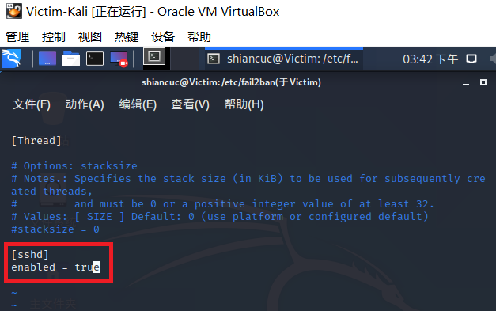

    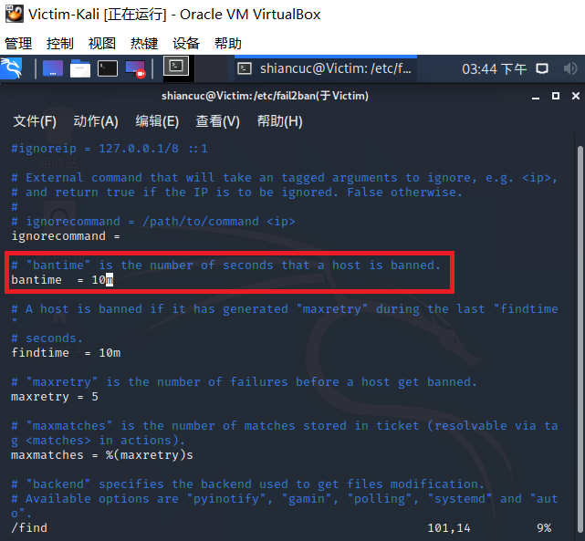

- 启用sshd jail后重启服务，暂时没有发现被禁止的ip

    ```bash
    # 查看jail信息
    fail2ban-client status

    # 查看 sshd jail 信息
    fail2ban-client status sshd
    ```

    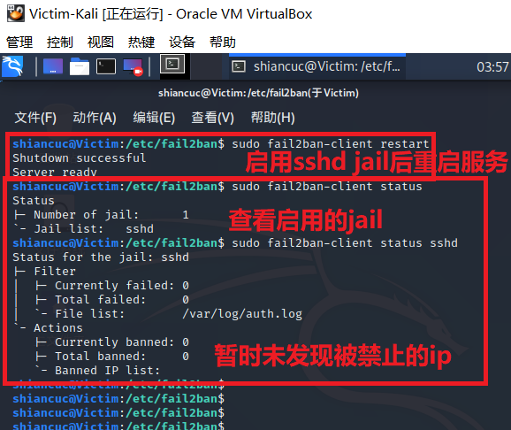

- 多次刷新后发现被禁止的ip

    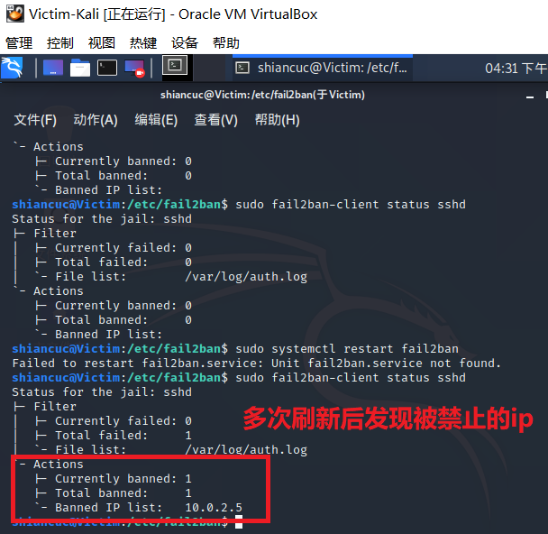

- 在防火墙中我们也可以看到被禁止的ip，说明该禁止的原理就是通过设置防火墙规则进行拒绝

    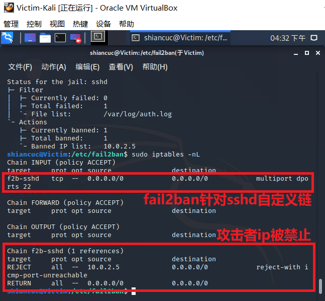

-   查看日志
    ```bash
    # 查看日志，默认显示最后10行
    tail /var/log/fail2ban.log
    ```

    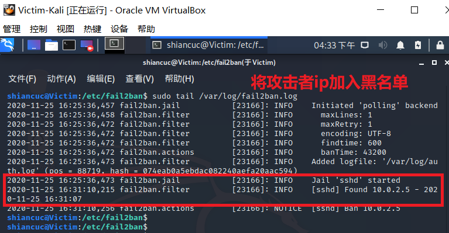

- 恢复实验环境

    ```bash
    # 清空jail，无需重启fail2ban服务
    fail2ban-client unban all
    ```

    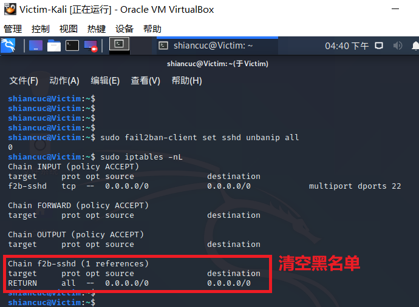


## 参考资料

- [第十章 应用程序安全加固](https://c4pr1c3.github.io/cuc-ns/chap0x10/main.html)

- [2018-NS-Public-jckling/ns-0x10/chap0x10实验.md](https://github.com/CUCCS/2018-NS-Public-jckling/blob/ns-0x10/ns-0x10/chap0x10%E5%AE%9E%E9%AA%8C.md)

- [2019-NS-Public-chencwx/ns_chapter10/README.md](https://github.com/CUCCS/2019-NS-Public-chencwx/blob/ns_chap0x10/ns_chapter10/README.md)

- [Proper fail2ban configuration](https://github.com/fail2ban/fail2ban/wiki/Proper-fail2ban-configuration)