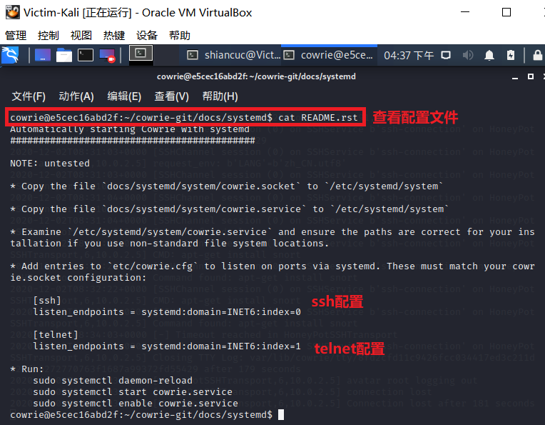

# 常见蜜罐体验和探索

## 实验目的

- 了解蜜罐的分类和基本原理
- 了解不同类型蜜罐的适用场合
- 掌握常见蜜罐的搭建和使用

## 实验环境

- 从[paralax/awesome-honeypots](https://github.com/paralax/awesome-honeypots)中选择 1 种低交互蜜罐和 1 种中等交互蜜罐进行搭建实验

    - 推荐`SSH`蜜罐

- 实验拓扑图

    


## 实验要求

- [x] 记录蜜罐的详细搭建过程；

- [x] 使用 `nmap` 扫描搭建好的蜜罐并分析扫描结果，同时分析「 `nmap` 扫描期间」蜜罐上记录得到的信息；

- [x] 如何辨别当前目标是一个「蜜罐」？以自己搭建的蜜罐为例进行说明；

- [x] （可选）总结常见的蜜罐识别和检测方法；

- [ ] （可选）尝试基于 [canarytokens](https://github.com/thinkst/canarytokens) 搭建蜜信实验环境进行自由探索型实验；


## 实验过程

- 检查两台主机网络连通性

    

- 接下来的实验在`Victim`中搭建蜜罐，`Attacker`中模仿攻击者去攻击伪`Victim`

***

### ssh-Honeypot

- 一种极低交互式的简易蜜罐

- 在`Victim`中安装docker容器，便于实验的观察

    ```bash
    sudo apt-get update
    sudo apt-get install docker.io
    sudo apt-get install docker-compose
    ```

    

- 开启docker服务并测试是否安装成功

    ```bash
    sudo systemctl start docker
    sudo docker run hello-world
    ```

    

- 查看镜像

    ```bash
    sudo docker images
    ```

    

- 安装ssh-honeypot，首先确保libssh&libjson-c已经安装

    ```bash
    sudo apt-get install libssh-dev libjson-c-dev
    ```

    

- 安装ssh，暂时先不设置密码

    ```bash
    sudo ssh-keygen -t rsa -f ./ssh-honeypot.rsa
    ```

    

- 接下来安装`docker-ssh-honeypot`

    ```bash
    sudo git clone https://github.com/random-robbie/docker-ssh-honey
    sudo docker build . -t local:ssh-honeypot # 构建镜像
    sudo docker run -p 2234:22 local:ssh-honeypot # 运行镜像 格式为本地端口:容器端口 
    sudo docker exec -i -t id bash # 进入容器
    tail -F ssh-honeypot.log # 查看日志
    ```

    

    

- 通过`docker ps`查看容器的id，这样才能进入容器

    ```bash
    sudo docker ps
    sudo docker exec -i -t container_id bash # 进入容器
    tail -F ssh-honeypot.log # 查看日志
    ```

    

- 可以进行查看日志，这样即可看到攻击者的行为，为了作对比，暂时我们先不做任何操作，查看当前的日志，发现确实并未记录下任何信息

    ```bash
    tail -F ssh-honeypot.log # 查看日志
    ```

    

- 接下来让`Attacker`对蜜罐所在主机端口进行ssh连接，进行观察，发现安装蜜罐的主机日志已经把该行为记录下来了

- 再次多次连接，发现无论输什么密码，连接都会被拒绝，原因是ssh-honeypot是一个低交互式的蜜罐，无法完成这些功能，但是日志能记录下所有攻击者的行为

- 另外，仔细查看日志信息，我们发现攻击者的所有行为都被记录下来了，包括输入的密码等等，以及攻击者的ip也展露无遗，这达到了蜜罐的初步目标，即收集对方的信息

    

- 接着`Attacker`对目标主机进行nmap端口扫描，我们发现日志信息中并没有记录下，说明该蜜罐并未对此生效，也再一次说明了该蜜罐的低交互式，只是一个可以简单记录ssh连接的简易蜜罐

    

***

### Cowrie

- Cowrie是一种中到高交互性的SSH和Telnet蜜罐，旨在记录暴力攻击和攻击者执行的shell交互。在中等交互模式（shell）下，它以Python仿真UNIX系统；在高级交互模式（代理）下，它充当SSH和telnet代理，以观察攻击者对另一个系统的行为。

- Cowrie选择以仿真外壳运行（默认）：具有添加/删除文件功能的伪造文件系统。包含类似于Debian 5.0安装的完整伪造文件系统可能添加伪造的文件内容，以便攻击者可以监视/ etc / passwd等文件。仅包含最少的文件内容Cowrie保存使用wget / curl下载的文件或通过SFTP和scp上传的文件，以供以后检查；或将SSH和telnet代理到另一个系统:作为具有监控功能的纯telnet和ssh代理运行或者让Cowrie管理Qemu虚拟服务器池以提供登录到的系统。

- 在docker中安装Cowrie

    ```bash
    sudo docker pull cowrie/cowrie
    ```

    

- 启动`cowrie`，在端口`2222`开启

    

- 在`Attacker`中进行ssh连接攻击者，先使用正确的（其实说不上正确，毕竟本来就是伪造的）密码登录，发现日志信息已经记录下了所有行为

    

- 接下来不适用root用户连接，使用任意用户，发现在输入多次密码后被拒绝连接，猜想该蜜罐设置了不允许非root用户连接

    

- 对于root用户，我们继续使用任意密码登录，我们会发现，输任意密码都可以登录，这也是该蜜罐的特点之一。由此可见，蜜罐的安全性必须保证，否则攻击者输入的是一段恶意代码，很有可能最后蜜罐反被当成“肉机”

    

- 实验发现，没过多久，ssh连接就自动断开了，说明该蜜罐有设置连接时间限制，可能也是出于自我保护

    

- 接着查看一下cowrie的日志文件，先进入容器，并查看日志所在目录，查看日志文件，需要注意的是，该蜜罐的日志文件是json文件，在日志中，我们可以看到刚刚的`Attacker`连接的时间，ip等等信息

    ```bash
    sudo docker exec -i -t container_id bash # 进入容器
    cat cowrie.json # 查看日志
    ```

    

    

- 接下来在ssh连接的状态下，攻击者进行基本的连通性测试操作，发现`ping`和`curl`指令都正常运行了

    ```bash
    ping www.baidu.com # ping百度
    curl www.baidu.com # 获取页面
    ```

    

- 接下来试着执行`apt-get`指令进行上次实验中`snort`包的下载，看起来好像没什么问题

    

- 在蜜罐中查看下载下来的文件，发现能看到文件信息，但是不能使用

    

- 攻击者再次连续多次下载`snort`，发现每次都是新下载的，这说明前面下的是假的可执行文件，对于攻击者来说，很有可能就从这里发现蜜罐的存在了。按经验来说，连续的下载得到的回复应该是已安装，而不是新的安装

    

- 接着，尝试对“靶机”进行nmap扫描，发现日志中居然也没有记录下这个信息，这个蜜罐也还是不太完善，但已经算是较高交互式的了

    ```bash
    sudo nmap -sX -p 2222 -n -vv 10.0.2.15
    ```

    

- 另外，查看一下cowrie的配置文件，配置文件详细信息如下

    

- 通过查阅官方文档，发现可以查看该蜜罐支持的命令，数目还是不小的，搭建蜜罐的过程中，也要格外注意命令的支持，尽量做到“真机有的我都有”

    

- 查看文件分区，其实这是蜜罐搭建过程中非常重要的一步，因为攻击者很容易看出一些不太合理的文件分区

    

- 在攻击者主机和容器内查看文件目录如下，在蜜罐容器内可以看到配置文件的信息，而攻击者中看不到，这也符合蜜罐的要求，毕竟这一旦被发现，“蜜罐”的存在也展露无遗了

    

- 查看错误信息

    

- 在`bin`目录下还有很多与蜜罐配置相关的信息，可以看到对用户的响应方式等

    

***

## 实验总结

### 如何辨别当前目标是一个「蜜罐」

- 入侵时应当保持谨慎的态度，细心观察当前环境，并结合之前的使用经验进行比较分析

- 目标突破的难易程度也可以作为辨别的依据，过于简单或是利用常见漏洞就能进入的目标，可以在很大程度上怀疑其为蜜罐

- 如果蜜罐模拟得不够完善，多尝试几个命令，或添加一些选项，就会让其露出马脚

- 命令的返回也值得观察与分析，包括没进入蜜罐前的连接的返回信息

- 由于系统不会给蜜罐分配很多资源，当遇到需要与网络进行通讯时，可能会出现速度下降的情况


### 常见的蜜罐识别和检测方法

- 对低交互蜜罐的识别，主要集中在模拟技术的检测上（通常存在着较为明显的特征）

- 高交互蜜罐通常使用虚拟机进行部署，常用虚拟机探测技术进行识别

    - 虚拟机探测的目标：检查当前代码是否正运行在一台虚拟的主机上

        - 根据文件系统和注册表中的虚拟机信息探测
        - 根据虚拟主机的内存分配特征探测
        - 根据虚拟主机的硬件特征探测
        - 根据虚拟主机中的特殊指令与通道探测

- 高交互蜜罐通常采用内核级隐藏技术，主要有隐藏模块、隐藏文件、隐藏进程、隐藏连接等技术，可通过对隐藏技术的识别来进行判断

<br>

- 从实验中，可以总结以下经验：

    - 在安装包的时候发现了蜜罐与普通真机的不同，通过这个能初步判断“陷入”了蜜罐的陷阱中；
    - 在进行ssh连接时，发现任意密码都能登录，这也是暴露点之一；
    - 在目录中看不到应有的配置文件的存在，这也许是蜜罐搭建者想刻意隐瞒的信息

- 在上述实验中，我们发现`ssh-honeypot`确实是一个低交互式的蜜罐，仅用于记录攻击者的信息，而`cowrie`是一个相对交互式较高、较完善的蜜罐，可以进行ssh远程连接等等一系列“类似真机”的操作


## 参考资料

- [docker-ssh-honeypot](https://github.com/random-robbie/docker-ssh-honey)

- [cowrie](https://github.com/cowrie/cowrie)

- [cowrie mannual](https://cowrie.readthedocs.io/en/latest/index.html)

- [第十一章 蜜罐和蜜网](https://c4pr1c3.github.io/cuc-ns/chap0x11/main.html)

- [2019-NS-Public-chencwx/ns_chapter11/README.md](https://github.com/CUCCS/2019-NS-Public-chencwx/blob/ns_chap0x11/ns_chapter11/README.md)
